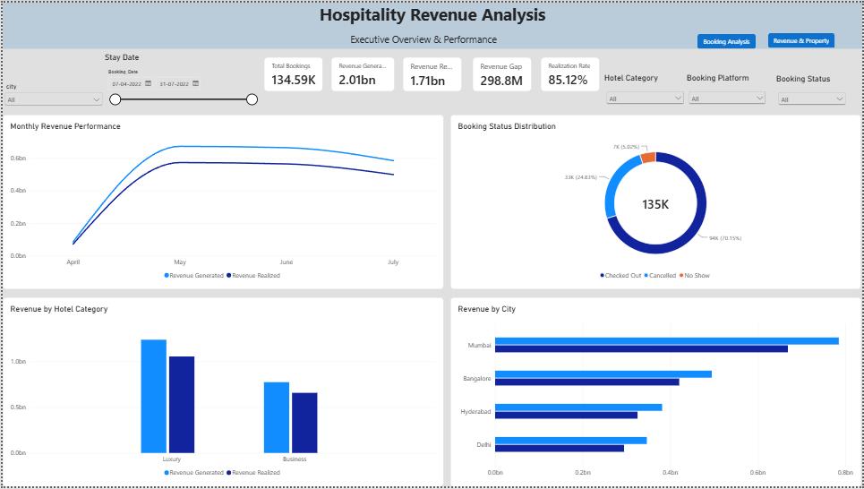
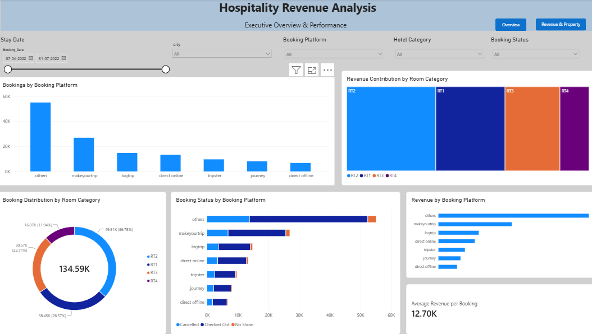
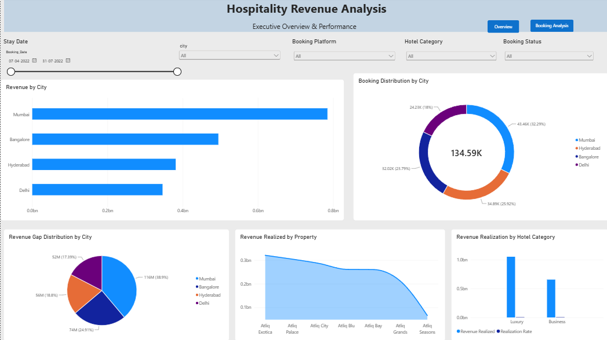

# Hospitality Revenue Analysis

An interactive Power BI dashboard for analyzing hotel revenue, bookings, occupancy, and overall hospitality performance.

## 📊 Project Overview

This project analyzes hospitality business data to identify key revenue and operational trends. The dashboard transforms raw hotel data into interactive business insights using Power BI.

## 🎯 Objectives

- Analyze overall hotel revenue performance
- Track key hospitality KPIs
- Understand booking and occupancy trends
- Compare performance across hotels and properties
- Identify revenue patterns and business opportunities
- Support data-driven business decisions

## 🛠️ Tools & Technologies

- Power BI
- Power Query
- DAX
- Excel / CSV
- Data Visualization

## 📈 Dashboard

The dashboard provides an interactive view of:

- Revenue performance
- Booking trends
- Occupancy
- Hotel/property performance
- Key business KPIs
- Revenue trends over time

## 🔍 Key Analysis

The analysis focuses on:

- Revenue generation
- Booking performance
- Occupancy trends
- Property-level performance
- Business performance over time

## 💡 Business Value

The dashboard helps hospitality management:

- Monitor revenue performance
- Identify changes in booking and occupancy patterns
- Compare property performance
- Track important business KPIs
- Support data-driven business decisions

## 📁 Project Files

```text
Hospitality-Revenue-Analysis/
│
├── README.md
├── Hospitality_Revenue_Analysis.pbix
│
└── screenshots/
    ├── page1_dashboard.png
    ├── page2_dashboard.png
    └── page3_dashboard.png
```

## 📷 Dashboard Preview

### Page 1



### Page 2



### Page 3



    └── page3_dashboard.png
```

Then:

```markdown
## 📷 Dashboard Preview
```

So visually:

```text
└── page3_dashboard.png
```


**Important:** ...
```

Those were instructions for you, not part of the README.

After making this change, click **Preview**. The three dashboard images should render as actual images. Then you can commit the README.
